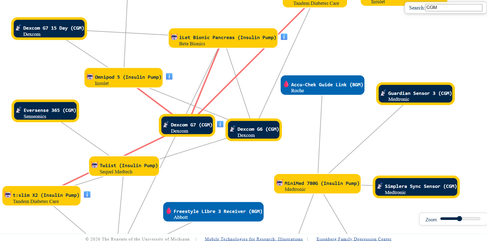
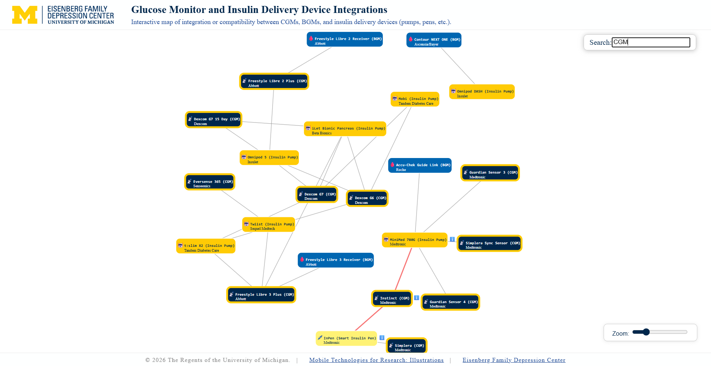

# Device Integration Diagrams

## Description
Interactive maps of integration/compatibility between wearables, nearables, and other mobile devices.

## Quick Start Guide
+ See the list of available diagrams below, and click the "View Live" link to open it.
+ To edit, download the corresponding diagram file. Some files, such as HTML/JavaScript, will have a section with input parameters that can be configured to change the diagram.

## List of Available Device Integration Diagrams

### Glucose Monitor and Insulin Delivery Device Integrations
Interactive map of integration or compatibility between CGMs, BGMs, and insulin delivery devices (pumps, pens, etc.).

[View Live](https://code.depressioncenter.org/mobile-tech-illustrations/device-integration-diagrams/GlucoseMonitor-InsulinDeliveryDevice-Integration.html)  |  [View Code](https://github.com/DepressionCenter/mobile-tech-illustrations/blob/main/device-integration-diagrams/GlucoseMonitor-InsulinDeliveryDevice-Integration.html)

## Additional Resources
+ [Mobile Technologies for Research: Illustrations (Main Page)](https://github.com/DepressionCenter/mobile-tech-illustrations)
+ [D3.js:](https://d3js.org/) JavaScript data visualization library.

## About the Team
The [Mobile Technologies Core](https://depressioncenter.org/mobiletech) provides investigators across the University of Michigan the support and guidance needed to utilize mobile technologies and digital mental health measures in their studies. Experienced faculty and staff offer hands-on consultative services to researchers throughout the University – regardless of specialty or research focus.

## Contact
To get in touch, contact the individual developers in the check-in history.

If you need assistance identifying a contact person, email the EFDC's Mobile Technologies Core at: efdc-mobiletech@umich.edu.

## Credits
#### Contributors:
+ Eisenberg Family Depression Center [(@DepressionCenter)](https://github.com/DepressionCenter/)
+ Gabriel Mongefranco [(@gabrielmongefranco)](https://github.com/gabrielmongefranco)

#### This work is based in part on the following projects, libraries and/or studies:
+ [D3.js JavaScript data visualization library](https://d3js.org/)
+ [EFDC TDX Knowldge Base Templates](https://github.com/DepressionCenter/EFDC-TDX-KB)

## License
### Copyright Notice
Copyright © 2024-2026 The Regents of the University of Michigan

### Software and Library License Notice
This program is free software: you can redistribute it and/or modify it under the terms of the GNU General Public License as published by the Free Software Foundation, either version 3 of the License, or (at your option) any later version.

This program is distributed in the hope that it will be useful, but WITHOUT ANY WARRANTY; without even the implied warranty of MERCHANTABILITY or FITNESS FOR A PARTICULAR PURPOSE. See the GNU General Public License for more details.

You should have received a copy of the GNU General Public License along with this program. If not, see <https://www.gnu.org/licenses/gpl-3.0-standalone.html>.

### Documentation License Notice
Permission is granted to copy, distribute and/or modify this document 
under the terms of the GNU Free Documentation License, Version 1.3 
or any later version published by the Free Software Foundation; 
with no Invariant Sections, no Front-Cover Texts, and no Back-Cover Texts. 
You should have received a copy of the license included in the section entitled "GNU 
Free Documentation License". If not, see <https://www.gnu.org/licenses/fdl-1.3-standalone.html>

## Citation
If you find this repository, code or paper useful for your research, please cite it.

#### Citation Example:
>_Mongefranco, Gabriel. Mobile Technologies for Research: Illustrations. University of Michigan. Software. https://github.com/DepressionCenter/mobile-tech-illustrations_  
​​​​​​​     _DOI: [10.5281/zenodo.18165506](https://doi.org/10.5281/zenodo.18165506)_

----

Copyright © 2024-2026 The Regents of the University of Michigan