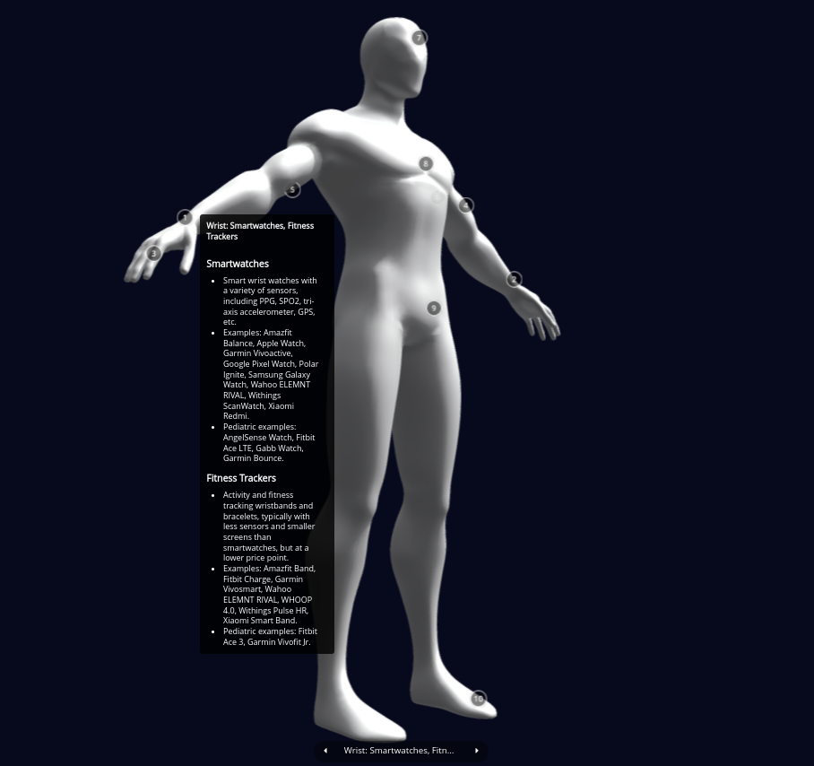

# Wearable Device Types by Body Part

## Description
A human body annotated with common types of consumer-grade wearables used in research. This 3D model has clickable areas on different body parts that display the device types that can be worn on that area.  

## Quick Start Guide
+ Ready-to-use exports: [View Online](https://sketchfab.com/models/42c9fc2d50474cb6a44a1d02c9f60b3c/embed?autostart=1&annotations_visible=1&annotation=0&dnt=1)
+ To edit, download from the source directory and edit in Blender, then re-upload to Sketchfab and edit the annotations there.

## Documentation
### Annotations
<table>
  <thead>
  <tr>
    <th>No.</th>
    <th>Body Area</th>
    <th>Title</th>
    <th>Description</th>
  </tr>
  </thead>
<tbody>
  <tr>
    <td>1</td>
    <td>Wrist</td>
    <td>Wrist: Smartwatches, Fitness Trackers</td>
    <td>
      
### Smartwatches
+ Smart wrist watches with a variety of sensors, including PPG, SPO2, tri-axis accelerometer, GPS, etc.  
+ Examples: Amazfit Balance, Apple Watch, Garmin Vivoactive, Google Pixel Watch, Polar Ignite, Samsung Galaxy Watch, Wahoo ELEMNT RIVAL, Withings ScanWatch, Xiaomi Redmi.  
+ Pediatric examples: AngelSense Watch, Fitbit Ace LTE, Gabb Watch, Garmin Bounce.  

### Fitness Trackers
+ Activity and fitness tracking wristbands and bracelets, typically with less sensors  and smaller screens than smartwatches, but at a lower price point.  
+ Examples: Amazfit Band, Fitbit Charge, Garmin Vivosmart, Wahoo ELEMNT RIVAL, WHOOP 4.0, Withings Pulse HR, Xiaomi Smart Band.  
+ Pediatric examples: Fitbit Ace 3, Garmin Vivofit Jr.
</td>
  </tr>
  <tr>
    <td>2</td>
    <td>Wrist</td>
    <td>Wrist: BP Cuffs, Other Health Monitors</td>
    <td>

### Connected Blood Pressure Monitors (Wrist Cuff)
+ Wireless BP monitors worn at the wrist.  
+ Examples: iHealth Push, Omron 7-Series / Gold Wireless BPM.  
      
### Other Wrist Devices
+ Other devices may include: BP watches, Bluetooth glucometer watches, continuous SPO2 monitors, motion and body position sensors, and diving computers.
</td>
  </tr>
  <tr>
    <td>3</td>
    <td>Fingers</td>
    <td>Fingers: Smart Rings, Pulse Ox Meters</td>
    <td>
    
### Smart Rings
+ Finger-worn devices with similar health and fitness tracking capabilities to smartwatches or fitness trackers, often focused on sleep and activity tracking.  
+ Examples: Amazfit Helio Ring, Colmi R02 Smart Ring, Oura Ring, Samsung Galaxy Ring.  

### Connected Pulse Oximeters
+ Finger devices that measure SpO2 (blood oxygen saturation) level, pulse rate (bpm), perfusion index, and pulse strength.  
+ Examples: iHealth Air Pulse Oximeter, Oxiline Pulse XS Pro / MD Pro, Wellue O2Ring.  
+ Pediatric examples: Wellue KidsO2.</td>
  </tr>
  <tr>
    <td>4</td>
    <td>Upper Arm</td>
    <td>Upper Arm: HRM, Fitness Trackers, BP cuffs</td>
    <td>
    
### Heart Rate Monitors (Arm Band)
+ HRM worn on the upper arm, primarily for using during swimming or activities for which chest straps are not well suited. These HRMs typically use optical (PPG) sensors, and support Bluetooth (for smartphone connectivity) and ANT+ (for sports and gym equipment connectivity).  
+ Examples: Polar Verity Sense / OH1+, Wahoo TICKR FIT.  

### Fitness Trackers
+ Activity and fitness tracking armbands, or pods worn with specially-designed clothing.  
+ Examples: WHOOP 4.0, Xiaomi Mi Smart Band.  

### Connected Blood Pressure Monitors (Arm Cuff)
+ Connected BP monitors placed on the upper arm, sometimes with additional sensors for HR, SPO2, or ECG.  
+ Examples: Garmin BPM, iHealth Neo / Track, Omron Evolv Upper Arm / Gold / 7 / 9 / Complete, Oxiline Pressure XS, Withings BPM Connect / Core, Wellue BP2.
    </td>
  </tr>
  <tr>
    <td>5</td>
    <td>Back of Arm</td>
    <td>Back of Arm: CGMs</td>
    <td>
    
### Continuous Glucose Monitors (CGMs)
+ Skin patches or subcutaneous implants that provide continuous estimated blood glucose values, primarily using a small needle/sensor that detects glucose in interstitial fluids. Some CGMs can be integrated with insulin pumps in open-loop or closed-loop (automated insulin delivery, or artificial pancreas) systems, and typically connect to smartphones via Bluetooth.  
+ Some models can also be worn on the abdomen or upper buttocks.  
+ Examples (Rx-only): Abbott Freestyle Libre 14-day / 2 / 3, Dexcom G6 / G7, Medtronic Guardian Connect Sensor 3 / Simplera, Senseonics Eversense E3 / 365, etc.  
+ Examples (OTC): Abbott Lingo / Libre Rio, Dexcom Stelo, etc.
    </td>
  </tr>
  <tr>
    <td>6</td>
    <td>Underarms</td>
    <td>Underarms: Continous Body Temperature Patches</td>
    <td>
    
### Temperature Patches
+ Skin sensors to measure body core temperature. Depending on the model, some are worn on the underarms for axillary body temperature, forehead, or chest. They typically connect to smartphones via Bluetooth or NFC, and to other sports devices via ANT+.  
+ Examples (Rx-only): TempTraq, Vivalink Axillary Temperature Sensor.  
+ Examples (OTC): greenTEG CORE Sensor, SteadySense STEADYTEMP Sensor Patch.
    </td>
  </tr>
  <tr>
    <td>7</td>
    <td>Head</td>
    <td>Head: Smart Glasses, EEG Headsets, Earbuds</td>
    <td>
    
### Smart Glasses
+ Current smart glasses/frames and AI/AR/VR/XR headsets generally lack inertial and biometric sensors needed for research. However, a few brands have been introducing more sensors.  
+ Examples: Amazon Echo Frames, Magic Leap 2 AR Headset, Microoled Engo, QIDI Vida.  

### Earbuds / Headphones / Headbands
+ We are not currently aware of ear pieces with biometric sensors. However, some devices can be used for hearing tests (e.g. Apple AirPods Pro 2).  

### Other Neck and Head Devices
+ Additional devices may include: sleep monitor masks, swimming AR glasses, HRM swim goggle clip-on pods, jaw tracking devices, anti-snoring devices; and by prescription only: PAP and Dry EEG / EMG devices.
    </td>
  </tr>
  <tr>
    <td>8</td>
    <td>Chest</td>
    <td>Chest: HRM Chest Straps, Sleep / Temperature Pods, ECG Patches</td>
    <td>
    
### Heart Rate Monitor Chest Straps
+ Popular in fitness and exercise science, chest straps can stream heart rate measures to multiple devices via Bluetooth or ANT+.  
+ Examples: Garmin HRM Fit/Dual/Swim/Pro Plus, Polar H9/H10/T31 coded, Wahoo TRACKR HEART RATE, Wellue VisualBeat HRM patch/strap.  

### Sleep Position Pods
+ Sleep monitor devices with applications for pregnancy. In addition to sleep stages and common sleep metrics, they can track sleep position and alert users when changes are recommended.  
+ Examples: MyPregnancyCoach.

### Temperature Pods
+ Examples: greenTech CORE Sensor.  

### ECG / EKG / Holter Patches and Chest Straps
+ Examples (OTC): Wellue ECG Recorder.
</td>
  </tr>
  <tr>
    <td>9</td>
    <td>Torso / Pelvis</td>
    <td>Torso / Pelvis: Running Sensors, CGMs, Genital Sensors.</td>
    <td>
    
### Running Sensors
+ Clip-on sensors worn around the waist (front or back) to track torso movement and provide sports feedback.  
+ Examples: Garmin Running Dynamics Pod.  

### CMGs / Insulin Pumps
+ Some continuous glucose monitors can be worn on the abdomen or upper buttocks.  
+ Many insulin pumps, smart infusion ports, and smart injection ports are worn on the abdomen or upper arm.  

### Smart Penis Rings
+ Bluetooth genital sensors for male sexual health or urological metrics, including nighttime penile tumescence frequency, erection firmness and duration, urine flow analysis, etc.  
+ Examples (OTC): FirmTech TechRing.  

### Smartphones
+ Smartphone sensors can take advantage of carrying a phone in a pocket near the waist.
    </td>
  </tr>
  <tr>
    <td>10</td>
    <td>Foot / Ankle</td>
    <td>Foot / Ankle: Shoe Pods, In-Shoe Sensors</td>
    <td>
    
### Shoe Pods
+ Clip-on sensor pods for running speed, cycling speed/cadence, gait analysis, etc.  
+ Examples: Garmin Cadence / Speed Sensors, RunScribe Red Gait Lab Pods, Stryd Single / Duo Pods, Wahoo RPM Cadence / Speed Pods.  

### In-Shoe Sensors
+ Gait, pressure and position sensors placed under the feet, inside the shoe, oftentimes with an ankle-worn transmitter connected to the in-shoe sensor.  
+ Examples: Tekscan F-Scan Go.
    </td>
  </tr>
</tbody>
</table>

### Future Enhancements Needed
+ Use the Sketchfab JavaScript API to add annotations programatically, and keep them in CSV. Use GitHub Pages to publish the finished pages with JS and embed code.
+ Alternatively, do something similar without third parties by utilizing a different, open source JS 3D library that can run on the client side.

## Additional Resources
+ 3D models are published on Sketchfab under the [Mobile Technologies for Research Illustrations](https://skfb.ly/prVqv) collection.
+ Editors for source files:
  + [Blender](https://www.blender.org)
  + [Dia](https://wiki.gnome.org/Apps/Dia)
  + [Draw.io / Diagrams.net](https://app.diagrams.net)
  + [Gimp](https://www.gimp.org)
  + [Inkscape](https://www.microsoft.com/en-us/microsoft-365/visio/flowchart-software)
  + [Microsoft Visio](https://www.microsoft.com/en-us/microsoft-365/visio/flowchart-software)
  + Office application suites - [Calligra Suite](https://calligra.org/), [LibreOffice](https://www.libreoffice.org/), [Microsoft Office / 365](https://office.microsoft.com/)

## About the Team
The [Mobile Technologies Core](https://depressioncenter.org/mobiletech) provides investigators across the University of Michigan the support and guidance needed to utilize mobile technologies and digital mental health measures in their studies. Experienced faculty and staff offer hands-on consultative services to researchers throughout the University – regardless of specialty or research focus.

## Contact
To get in touch, contact the individual developers in the check-in history.

If you need assistance identifying a contact person, email the EFDC's Mobile Technologies Core at: efdc-mobiletech@umich.edu.

## Credits
#### Contributors:
+ Eisenberg Family Depression Center [(@DepressionCenter)](https://github.com/DepressionCenter/)
+ Gabriel Mongefranco [(@gabrielmongefranco)](https://github.com/gabrielmongefranco)

#### This work is based in part on the following projects, libraries and/or studies:
+  “HUMAN_BODY” (https://skfb.ly/oonHG) by vistaalienprime is licensed under Creative Commons Attribution (http://creativecommons.org/licenses/by/4.0/).

## License
### Copyright Notice
Copyright © 2024 The Regents of the University of Michigan

### Software and Library License Notice
This program is free software: you can redistribute it and/or modify it under the terms of the GNU General Public License as published by the Free Software Foundation, either version 3 of the License, or (at your option) any later version.

This program is distributed in the hope that it will be useful, but WITHOUT ANY WARRANTY; without even the implied warranty of MERCHANTABILITY or FITNESS FOR A PARTICULAR PURPOSE. See the GNU General Public License for more details.

You should have received a copy of the GNU General Public License along with this program. If not, see <https://www.gnu.org/licenses/gpl-3.0-standalone.html>.

### Documentation License Notice
Permission is granted to copy, distribute and/or modify this document 
under the terms of the GNU Free Documentation License, Version 1.3 
or any later version published by the Free Software Foundation; 
with no Invariant Sections, no Front-Cover Texts, and no Back-Cover Texts. 
You should have received a copy of the license included in the section entitled "GNU 
Free Documentation License". If not, see <https://www.gnu.org/licenses/fdl-1.3-standalone.html>

## Citation
If you find this repository, code or paper useful for your research, please cite it.

----

Copyright © 2024 The Regents of the University of Michigan
